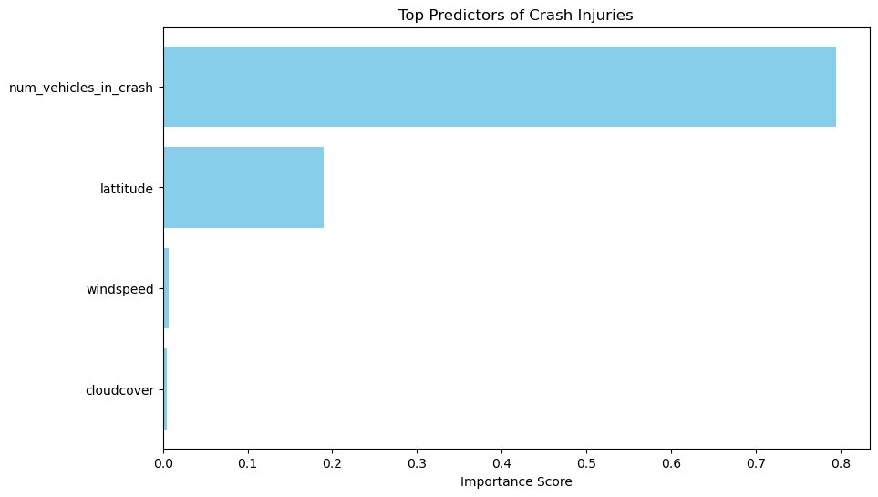

# Chicago-car-Crash-Prediction-and-Analysis

## BUSINESS UNDERSTANDING
## Problem Statement
Traffic accidents are a major concern in Chicago. Understanding the conditions that lead to severe crashes will help the Vehicle safety board.
This project aims to build a classification model that predicts whether a car crash will result in injuries based on environmental factors or other factors. The insights from this model will help identify high risk conditions and implement preventive measures to imrove road safety.

## Stakeholders
- Vehicle safety board
   - Responsible for road safety
   - Implement safety programs
   - They will use this model to identify high risk driving conditions and issue weather related alerts 
- City of Chicago
    - Responsible for infrastructure

## Key Questions
1. What factors contribute to most crashes?
2. Under what conditions are crashes most likely to result in injuries?
3. Can we predict whether a crash will result in injuries based on environmental conditions?
4. Can we predict the primary contributory cause of accidents?
## Data Understanding
The dataset we are using has been obtained from kaggle, it contains car crashes in chicago from 2019 to 2022. Its particulary useful because it includes car crash variables and environmental factors that influence crash outcomes. It allows us to analyze patterns in traffic accidents.

------------------------------------------------------------------------

## Project Workflow

The project follows the **standard data science workflow:**

1.  Business Understanding
2.  Data Understanding
3.  Data Preparation
4.  Modeling
5.  Evaluation
6.  Conclusion and Recommendations

------------------------------------------------------------------------

## Data Preparation

Several preprocessing steps were performed before training the models:

-   Cleaning missing values
-   Mapping injury values to numeric format
-   Creating a binary target variable (`crash_severity_class`)
-   Feature engineering from crash dates
-   One-hot encoding categorical variables
-   Selecting relevant model features
-   Standardizing numerical variables using StandardScaler

Target Variable:

`crash_severity_class` - 1 = crash resulted in injuries - 0 = crash resulted
in no injuries

------------------------------------------------------------------------

## Feature Selection

The following features were selected for modeling:

-    windspeed
-    winddir
-    pressure
-    visibility
-    cloudcover
-    moonphase
-    lattitude
-    days_temp
-    num_vehicles_in_crash

These features represent environmental conditions and crash
characteristics that may influence injury outcomes.

------------------------------------------------------------------------

## Models Used

Two machine learning models were used in this project:

### 1. Logistic Regression (Baseline Model)

Logistic Regression was used as the baseline classifier. It provides a
simple and interpretable model for binary classification problems.

### 2. Decision Tree Classifier

A Decision Tree model was used as the second model to capture more
complex relationships between variables.

------------------------------------------------------------------------
## Process
-   Train_test split of 80/20
-   Feature scaling
-   Cross_validation
## Model Evaluation

Models were evaluated using:

-   Accuracy Score
-   Confusion Matrix
-   ROC_AUC
-   Classification Report (Precision, Recall, F1-score)

These metrics help measure how well the models predict injury outcomes.

------------------------------------------------------------------------

The performance of the models was compared using accuracy scores.

The comparison helps determine which model performs better in predicting
injury-related crashes.

------------------------------------------------------------------------

## Key Insights

The analysis helps identify:

-   Environmental conditions associated with higher injury risk
-   Crash patterns linked to severe accidents
-   Predictive indicators of injury-causing crashes

These insights can help authorities implement preventative measures to improve road safety.

------------------------------------------------------------------------

## Recommendations
-   Improve intersections -Use roundabouts or better signaling

-   Target high-risk zones -Deploy speed cameras and patrols

-   Weather alerts - Notify drivers during risky conditions 

-   Emergency response system - Use model predictions to prioritize dispatch

## Colclusion

While a standard model prioritizes on accuracy, we optimized for recall. The model reveals thst the more the cars at in interserctions the higher the impact of accidents.
The city should focus on multi vehicle intersections within the high risk lattitude and the allocate resources where they will have immediate impact on saving lives